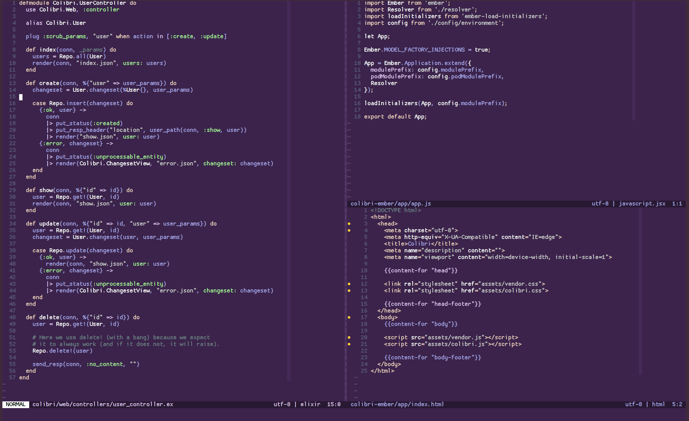

# colibri



A subtle colorscheme for Vim.

I've always appreciated color schemes, but felt that they often
add more visual clutter than I needed (using more than a few colors distracts my
eye and makes the file look more [like a box of crayons](http://www.linusakesson.net/programming/syntaxhighlighting/syntax2.png)).

I wanted a color scheme that would be minimal, look good at all times of the
day, and work well with f.lux at night.

Colibri is a genus of hummingbird, which inspired the base colors for this
scheme (long story short, I sampled these colors from a photograph of
a hummingbird for a web UI project that I never ended up finishing).

## Design rationale

1. Different colors should be used minimally as a way of visual cues. Use
   similar handpicked shades to introduce subtle contrast.
2. Regular text should complement the background; [pure white or pure black
   overpower](https://ianstormtaylor.com/design-tip-never-use-black/) and should
   be used sparingly to draw attention.
3. Start minimal, tweak often, introduce colors as needed.

I use the complement green for constants to introduce some contrast, especially
for elixir/ruby symbols (I think it could be a bit subtler, but that's the best
complement green I found after 10-20 iterations).

## Installation

```vim
" vim-plug
Plug 'archseer/colibri.vim'
" NeoBundle
NeoBundle 'archseer/colibri.vim'
" Vundle
Plugin 'archseer/colibri.vim'
```

If you don't use a plugin manager just copy the content of vim/colors/ to ~/.vim/colors.

When you have the plugin installed, you can set it in your vimrc:

###### For 24 Bit Terminals
```VimL
set termguicolors
colorscheme colibri
```

###### For GUI
```VimL
colorscheme colibri
```

There is some support for a 256 color version, but the colors are much cruder.

## Contributing

Contributors are welcome! There's still a lot of room for improvement, so any
suggestions or patches are appreciated.
